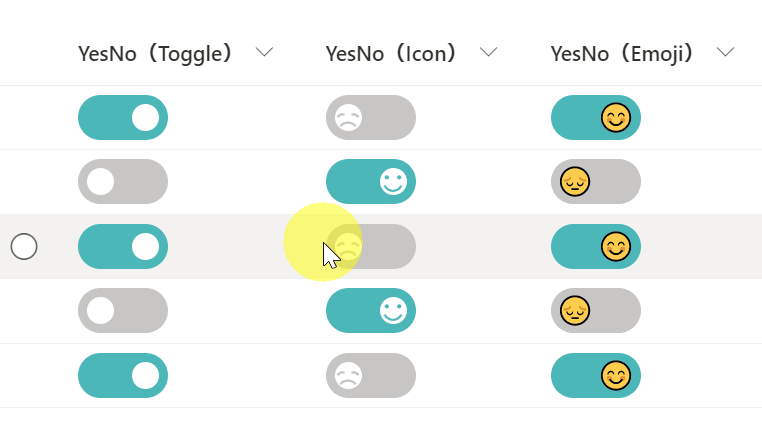

# Yes/No Column Toggle

## Podsumowanie
Ta próbka pokazuje changing the value of the Yes/No column to a toggle. Three different versions of the sample are provided (Toggle, Icon, & Emoji). Also, this sample uses the `setValue` of `customRowAction` to update the field. Musisz set the `actionInput` to the internal name of the column to be updated.

## Wymagania widoku
Ten format można zastosować do a Yes/No column.

## Przykład

Rozwiązanie|Autor(zy)
--------|---------
yesno-toggle-format.json | [Tetsuya Kawahara](https://github.com/tecchan1107)
yesno-toggle-icon-format.json | [Tetsuya Kawahara](https://github.com/tecchan1107)
yesno-toggle-emoji-format.json | [Tetsuya Kawahara](https://github.com/tecchan1107)

## Historia wersji

Wersja |Data              |Uwagi
--------|------------------|--------
1.0     |kwietnia 29, 2021    |Wersja początkowa
1.1     |listopada 21, 2021 |Modified to update item using `setValue`

## Zastrzeżenie
**TEN KOD JEST DOSTARCZANY W STANIE *TAKIM, W JAKIM JEST*, BEZ JAKIEJKOLWIEK GWARANCJI, WYRAŹNEJ ANI DOROZUMIANEJ, W TYM TAKŻE DOROZUMIANYCH GWARANCJI PRZYDATNOŚCI DO OKREŚLONEGO CELU, WARTOŚCI HANDLOWEJ ANI NIENARUSZANIA PRAW.**

---

## Dodatkowe uwagi

There is also a way to implement this with SPFx Extension, available from PnP: [React Toggle Field Customizer](https://github.com/pnp/sp-dev-fx-extensions/tree/main/samples/react-field-toggle)

